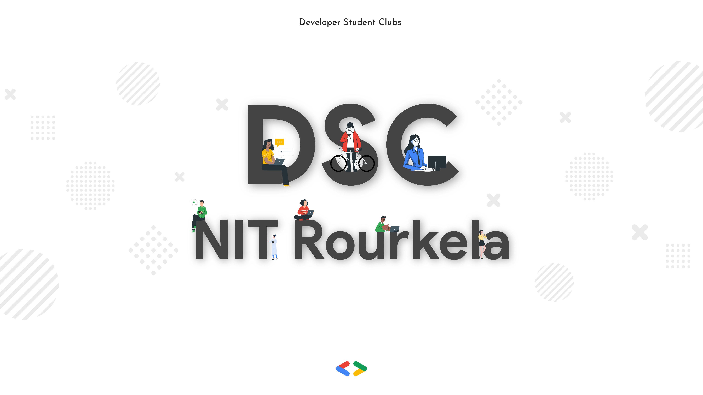

[](https://github.com/zepfietje/starware)

<!-- ALL-CONTRIBUTORS-BADGE:START - Do not remove or modify this section -->

[](#contributors-)

<!-- ALL-CONTRIBUTORS-BADGE:END -->

<br />
<p align="center">
  <a href="#">
    
  </a>

  <h3 align="center">Project Huckleberry</h3>

  <p align="center">
    The official repository for the website of GDSC NIT Rourkela
  </p>
</p>

<!-- TABLE OF CONTENTS -->
<details open="open">
  <summary>Table of Contents</summary>
  <ol>
    <li>
      <a href="#about-the-project">About The Project</a>
      <ul>
      </ul>
        <li><a href="#built-with">Built With</a></li>
    </li>
    <li>
      <a href="#getting-started">Getting Started</a>
      <ul>
        <li><a href="#prerequisites">Prerequisites</a></li>
        <li><a href="#contribution-guidlines">Contribution guidlines</a></li>
        <li><a href="#local-repository-setup">Local Repository Setup</a></li>
        <li><a href="#running-the-project">Running the project</a></li>
      </ul>
    </li>
    <li><a href="#license">License</a></li>
    <li><a href="#dsc-nit-rourkela">DSC NIT Rourkela</a></li>
    <li><a href="#starware">Starware</a></li>
    <li><a href="#contributors">Contributors</a></li>
  </ol>
</details>

## About The Project

Project Huckleberry

## Built With

Following technologies and libraries are used for the development of this website

- [React]()
- [NextJs]()
- [Tailwind]()
- [Prisma]()
- [Auth.js]()

## Getting Started

To setup the project locally the steps below.

### Prerequisites

- [Node.js](https://nodejs.org/en/download/)

  ```sh
  # Homebrew
  brew install nodejs

  # Sudo apt
  sudo apt install nodejs

  # Packman
  pacman -S nodejs

  # Module Install
  dnf module install nodejs:<stream> # stream is the version

  # Windows (chocolaty)
  cinst nodejs.install

  ```

- [Yarn](https://classic.yarnpkg.com/en/docs/install/)

  ```sh
    npm install --global yarn
  ```

- [Git](https://git-scm.com/downloads)

  ```sh
    # Homebrew
    brew install git
  
    # Sudo apt
    apt-get install git
  
    # Packman
    pacman -S git
  
    # Module Install (Fedora)
    dnf install git
  
  ```

### Contribution guidlines

`Contributions are welcome 🎉🎉`

NOTE 1: Please abide by the [Contributing Guidelines](./CONTRIBUTING.md).

NOTE 2: Please abide by the [Code of Conduct](./CODE_OF_CONDUCT.md).

### Local Repository Setup

Please refer to the project's style and contribution guidelines for submitting patches and additions. In general, we follow the "fork-and-pull" Git workflow.

1.  **Fork** the repo on GitHub
2.  **Clone** the project to your local system
3.  **Commit** changes to your own separate branch
4.  **Push** your work back up to your fork
5.  Submit a **Pull request** so that we can review your changes

### Running the project

The project uses Yarn as the package manager. It is strictly advised to use Yarn instead of NPM to avoid dependency conflicts.

1. **Install Dependencies**
   ```sh
   yarn install
   ```

2. **Environment Setup**
   - Create a new `.env` file in the root directory
   - Copy the contents from `.sample.env` as reference
   - Update the environment variables as needed

3. **Database Setup**
   ```sh
   # Generate Prisma Client
   yarn generate

   # Run database migrations
   yarn migrate
   ```

4. **Development Server**
   ```sh
   # Start the development server with Turbopack
   yarn dev
   ```

5. **Additional Commands**
   ```sh
   # Run linting
   yarn lint

   # Fix linting issues
   yarn lint:fix

   # Check code formatting
   yarn prettier:check

   # Fix code formatting
   yarn prettier:fix

   # Open Prisma Studio (database GUI)
   yarn studio
   ```

The development server will start at `http://localhost:3000`

## License

Distributed under the MIT License. See `LICENSE` for more information.

## DSC NIT Rourkela

[![DSC NIT Rourkela][dsc-nitrourkela]](https://dscnitrourkela.org)

## Starware

dscnitrourkela/project-huckleberry is Starware.
This means you're free to use the project, as long as you star its GitHub repository.
Your appreciation makes us grow and glow up. ⭐

[product-screenshot]: src/public/gdg.jpg
[dsc-nitrourkela]: src/public/repoCover.png

## Contributors ✨

Thanks goes to these wonderful people ([emoji key](https://allcontributors.org/docs/en/emoji-key)):

<!-- ALL-CONTRIBUTORS-LIST:START - Do not remove or modify this section -->
<!-- prettier-ignore-start -->
<!-- markdownlint-disable -->
<table>
  <tbody>
    <tr>
      <td align="center" valign="top" width="14.28%"><a href="https://ayussh.vercel.app/"><br /><sub><b>Ayush</b></sub></a><br /><a href="https://github.com/dscnitrourkela/project-huckleberry/commits?author=ayussh-2" title="Code">💻</a></td>
      <td align="center" valign="top" width="14.28%"><a href="https://github.com/Cybrite"><br /><sub><b>Harsh</b></sub></a><br /><a href="https://github.com/dscnitrourkela/project-huckleberry/commits?author=Cybrite" title="Code">💻</a></td>
      <td align="center" valign="top" width="14.28%"><a href="https://github.com/siddharth-narayan-mishra"><br /><sub><b>siddharth</b></sub></a><br /><a href="https://github.com/dscnitrourkela/project-huckleberry/commits?author=siddharth-narayan-mishra" title="Code">💻</a></td>
      <td align="center" valign="top" width="14.28%"><a href="https://github.com/swaindhruti"><br /><sub><b>Dhrutinandan Swain</b></sub></a><br /><a href="https://github.com/dscnitrourkela/project-huckleberry/commits?author=swaindhruti" title="Code">💻</a></td>
      <td align="center" valign="top" width="14.28%"><a href="https://portfolioscyy.netlify.app/playground"><br /><sub><b>Ayan</b></sub></a><br /><a href="https://github.com/dscnitrourkela/project-huckleberry/commits?author=AYANscyy2" title="Code">💻</a></td>
      <td align="center" valign="top" width="14.28%"><a href="https://github.com/HIMANSHU6001"><br /><sub><b>Himanshu Kaushik</b></sub></a><br /><a href="https://github.com/dscnitrourkela/project-huckleberry/commits?author=HIMANSHU6001" title="Code">💻</a></td>
    </tr>
  </tbody>
  <tfoot>
    <tr>
      <td align="center" size="13px" colspan="7">
        
          <a href="https://all-contributors.js.org/docs/en/bot/usage">Add your contributions</a>
        </img>
      </td>
    </tr>
  </tfoot>
</table>

<!-- markdownlint-restore -->
<!-- prettier-ignore-end -->

<!-- ALL-CONTRIBUTORS-LIST:END -->

This project follows the [all-contributors](https://github.com/all-contributors/all-contributors) specification. Contributions of any kind welcome!
